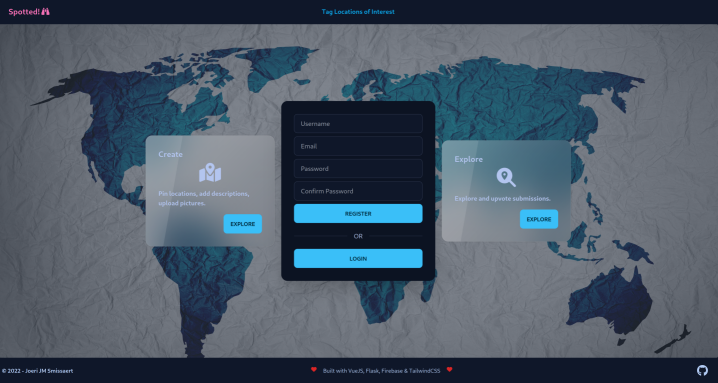

# Spotted
## Developers Institute - Final Project
A VueJS / Flask web application that allows users to geotag locations of interest using the Google Maps API, attach a description and add pictures.

[](https://app.netlify.com/sites/heroic-zuccutto-1ef6ac/deploys)  
*Demo*: https://spotted.joeri.xyz/



*Usage Instructions:*
- Register an account and login, or login using the demo credentials:  
demo@foo.bar / rabooftaomed

# spotted-client
The Spotted frontend, built with VueJS/Vite and TailwindCSS.

Features:
- Computed Properties
- Class and Style bindings
- Conditional rendering
- Pinia State Management
- Event handling
- Lifecycle hooks


### Project Setup

```sh
npm install
```

### Compile and Hot-Reload for Development

```sh
npm run dev
```

### Compile and Minify for Production

```sh
npm run build
```

# spotted-api
The Spotted backend, a REST API built with Python & the Flask framework.

### Project Setup

```sh
python3 -m venv venv
source venv/bin/activate
pip3 install -r spotted-api/requirements.txt
```

### Run Development Server

```sh
python3 spotted-api/app.py
```

### Or using Podman (or Docker)
```shell
cd spotted-api
podman build --tag spotted-api -f Dockerfile
podman run --name mySpottedApiContainerName -p 8080:8080 spotted-api
```
